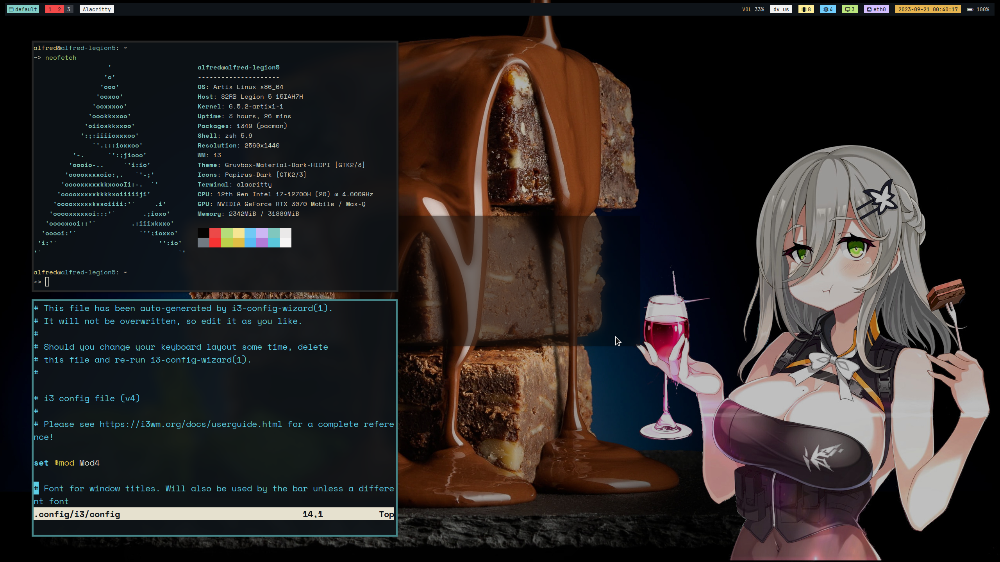

# Alfred's i3wm config & tutorial

這個repo是用來分享我的i3wm session 的一系列config檔，以及我對這些setup的理解

## 動機

* 有一個帥哥同學看到我現在的setup是怎麼設定的，當時的我正在忙者與線性代數戰鬥，所以沒空跟他說太多。忙完後，我心想：爲何不要開個repo，專門分享這些東西？順便練習一下維護github repo的能力～

* 現在這個repo正處於剛開始的階段，內容還有許多欠缺，我想內容要完整，至少要**一個月**的時間。但是我上傳的config檔，一定會確定是能運作的狀態(當然會有**dependency**的問題，不過我會說清楚需要的套件)

## 桌面截圖

* 現在還是半成品，會再慢慢加東西上去 (2023/9/21)

    

## 使用軟體

* window manager: i3
* status bar: polybar
* launcher: rofi
* terminal: alacritty
* file manager: dolphin
* icon theme: paprius
* notable mentions: stalonetray, feh, i3lock

## 設定

* i3, polybar, alacritty 的設定檔都放在 ```.config/<應用程式名稱>``` 裏面，所以直接將資料夾複製即可，例如：
    ```bash
    cp -r i3 $HOME/.config/
    ```

    * 記得將原本的資料夾備份！

## wiki 目錄

* 我不會將教學寫進這一個readme，會依主題分開寫，所有的說明都在 wiki 的資料夾裏面。

* [general]()

* i3
    1. [基本操作](https://github.com/AlfredSu1214/Alfred-i3-Config-and-tutorial/blob/main/wiki/i3/basic.md)
    2. [更多設定](https://github.com/AlfredSu1214/Alfred-i3-Config-and-tutorial/blob/main/wiki/i3/advanced.md)

* [polybar 說明]()

* [alacritty 說明]()

## TODO

* 完成i3的說明：mark，rule，多螢幕，外觀
