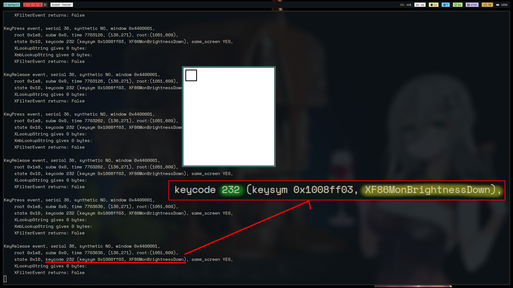
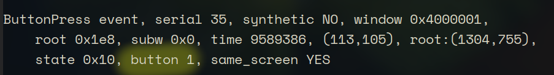
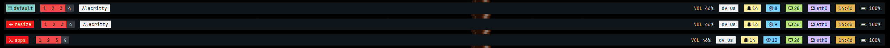

* 這個說明的目的是以config檔爲主，關於基本的操作；請看basic.md

* i3相對於其他window manager最大的好處是，她預設的config檔可用性已經很高了，只要自己再加一兩行設定就可以忘掉它；不過如果願意燒點腦、花點時間的話，體驗會更加舒適


## 0. 鍵位定義

#### 鍵盤定義
* 使用 ```bindsym``` 或 ```bindcode``` 定義鍵位：
    ```bash
    bindsym [--release] [<Group>+][<Modifiers>+]<keysym> command
    bindcode [--release] [<Group>+][<Modifiers>+]<keycode> command
    ```

* --release 可以規定一個shortcut被放開的時候該執行什麼動作
* Group指的是keyboard Layout，這個功能可以指定同一個binding在不同的layout下做不同的動作，通常用不到

* 怎麼知道keysym或keycode？
    * 在X Server，鍵盤上不同的輸入會被編碼爲不同的代碼；i3會接受這個代碼，如果是有被定義的動作，她就會執行。
    * 一般來說代碼就是鍵盤上寫的東西，但是有時候還是會不知道，例如：亮度調整的代碼是什麼？這個時候，就需要一些工具，像```xev```就是其中一個
* xev
    
    1. 在terminal 打 ```xev```
    2. 將滑鼠放入視窗裏面，按住你想知道keysym的鍵
    3. 可以開始看到terminal開始輸出，綠色的部分是keycode，黃色的部分是keysym。放到i3 的config檔，就能使用

#### 滑鼠定義
* 也是使用```bindsym```
    ```bash
    bindsym [--release] [--border] [--whole-window] [--exclude-titlebar] [<Modifiers>+]button<n> command
    ```
* --border: 滑鼠按到border時，也會有反應
* --whole-window: 滑鼠按到視窗的任何地方時，就會有反應
* --exclude-titlebar: 忽略titlebar

* 要知道滑鼠按鍵的代碼，也是可以用```xev```
    

* e.g.
    ```bash
    bindsym --whole-window $mod+button2 kill
    ```

## 1. 執行程式

#### 自動執行

* config檔當中可以指定在i3開始的時候，要一起執行哪些程式
* config文法
    ```bash
    exec --no-startup-id xss-lock --transfer-sleep-lock -- i3lock --nofork
    ```
* 建議可以將所有要開始的程式放在一個shell檔裏面，這樣管理上會更有彈性
    ```bash
    exec --no-startup-id bash -c '$HOME/.config/i3/autostart.sh'
    ```
#### 綁定shortcut

* 使用exec
    * e.g.
        ```bash
        bindsym $mod+Return exec alacritty
        bindsym XF86AudioMute exec --no-startup-id pactl set-sink-mute @DEFAULT_SINK@ toggle 
        ```
    * 語法： 
        ```
        exec [--no-startup-id] <command>
        exec_always [--no-startup-id] <command>
        ```

* 原本的config當中，用 \<Mod\> + Return 時會啓動終端機，預設的是```i3-sensible-terminal```，這個指令會開啓系統中存在的terminal。記得把這個值改成你想要的terminal

* --no-startup-id 是啥？ 看這裏： [link](https://www.reddit.com/r/i3wm/comments/5p75nw/any_reason_to_not_use_nostartupid/) ；實際上使用的感覺真的差不多

* 如果需要執行shell script，也可以直接將shell script的位置打上去作爲指令

## 2. mode

* 有用過vim 的都知道裏面有許多模式：
    

    * 不同的mode有不同的功能，例如insert mode可以輸入文字，visual mode可以利用滑鼠操作

* 在i3 當中也有和vim相當類似的功能，可以使用設定好的keybind進入到其他模式
    ```bash
    bindsym $mod+e mode apps
    ```

* 進入到其他模式時，可以用更簡單的按鍵組合做出想要的事

    ```bash
    bindsym $mod+e mode apps
    mode "apps" {
	bindsym u exec firefox
	bindsym --release u mode "default"
	bindsym e exec dolphin
    # 跳過...
	bindsym Return mode "default"
	bindsym Escape mode "default"
	bindsym $mod+e mode "default"
    }
    ```

    * 例如我想要執行Firefox(一個瀏覽器)的話，我會先按 ```<Win> + e``` 進入 ```"app"``` mode，然後按下 ```u``` 開啓後退出 ```"apps"``` 模式

* 優點：
    1. binding多的時候不需要將鍵位安排到整個鍵盤，方便記憶
    2. 不需要壓住 Shift 又壓住 Ctrl 又壓住這個那個，比較舒服
        

* 建議
    1. 記得一定要設定回```"default"```mode的binding，不然會卡在那裏
    2. 建議要把mode顯示出來(使用```i3-msg```)
        * 這個會在polybar的設定檔裏面說明
        

## 3. rule

* 有時候會遇到這種情況：
    1. 我的瀏覽器在workspace 1
    2. 我在其他workspace忙我的事情
    3. 突然需要用firefox，但是沒注意到workspace 1有firefox
    4. 我又開了一個新的firefox
    5. 重複 1. ~ 4.直到我發現已經亂掉了

> to be continued... 我需要再好好研究