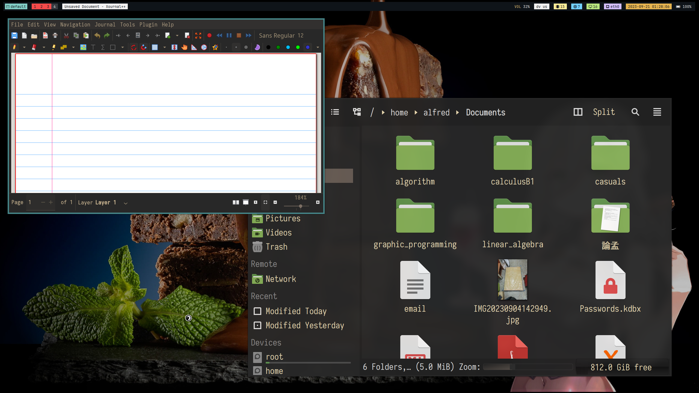
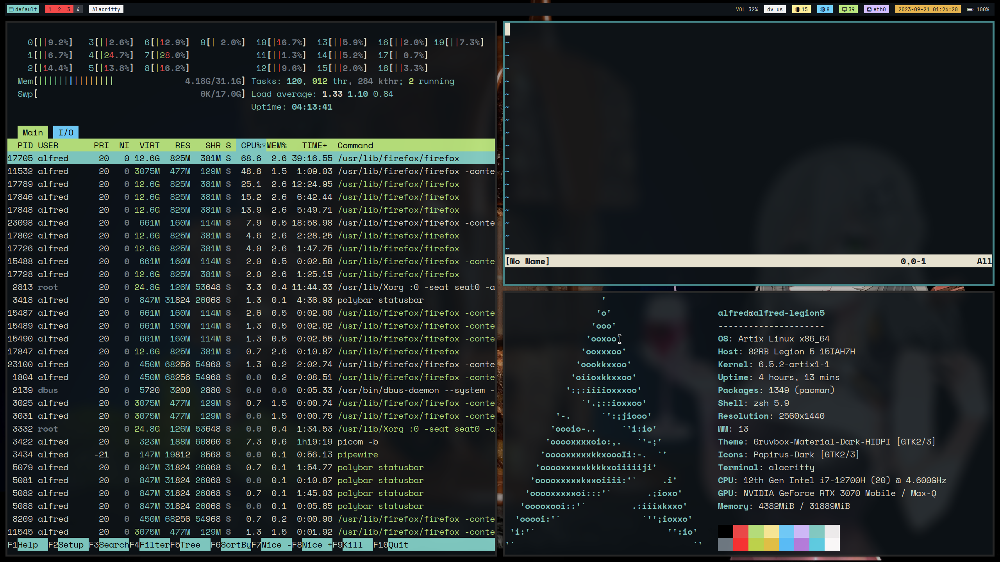

[[toc]]

* [i3wm.org](https://i3wm.org/)

我使用的鍵盤layout是dvorak，config檔也是依此設定

我之後會再配合qwerty寫config，現在的說明文件會依照qwerty寫

# i3 介紹

* i3wm 是一個平鋪式的window manager，但是她也支持一般常見的懸浮視窗

    
    > 懸浮視窗，視窗大小、位置可自由調整

    
    > 平鋪視窗，視窗會將視窗填滿

* 另外，i3 還可以以鍵盤對視窗進行操作
    * 這時，你可能會好奇，爲什麼不要用滑鼠就好？還要記一堆麻煩的東西... 以下是我的經驗
        1. 在打code的時候切換視窗需要將手移開、握住滑鼠、找到視窗將游標移上去。這樣一來，下次要打字的時候又要將手定位到正確的位置。
        2. 每次要執行一個動作的時候，需要依靠視覺定位需要的功能，但是鍵盤shortcut只需要靠感覺
    * 不過i3也可以定義滑鼠動作，有時候也能有所奇效

* 第一次打開i3時，會出現以下視窗(在角落，注意一下)：
    

    * 跟著提示按鍵作即可，建議 generate the config以及使用 \<Win\> (鍵盤上的windows logo鍵)
        * 使用 \<Alt\> 鍵的話可能會和應用程式衝突，而且 \<Win\>鍵在linux上是沒用途的

# 基本動作

* 這裏有cheat sheet:
    * mod 鍵被按下
    
    * Shift + mod 鍵同時被按下
    

    * 這個是i3使用預設的config檔時的動作，我會用括號表示我的config的設定值，基本config沒有提到的動作我會放後面。

* 個人認爲預設的config已經很好用了，我的動作也是以這個設定爲基礎建立的

## 1.視窗定位

* 一般而言，i3的視窗會有三種狀態：
    1. focused：目前使用的視窗
    2. inactive：放在旁邊的視窗
    3. urgent：有訊息跑出來的視窗

#### 切換使用的視窗

* &uarr; k(k) 、&darr; l(l)、&larr; j(j)、&rarr; ;(;)

* 將焦點放在目前任一方向的另一視窗

> to be continued...
