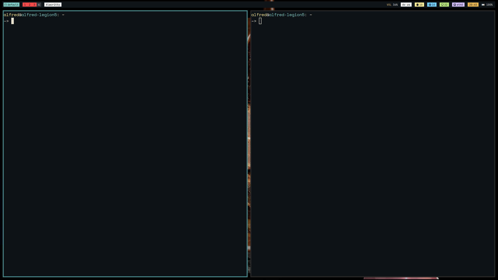
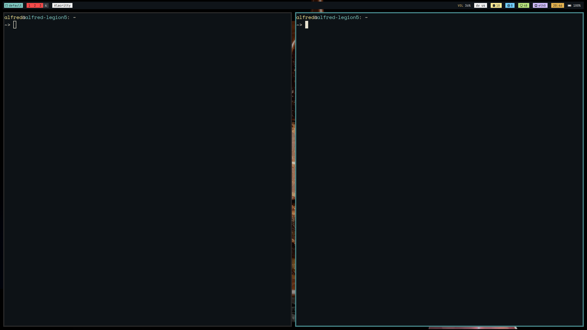
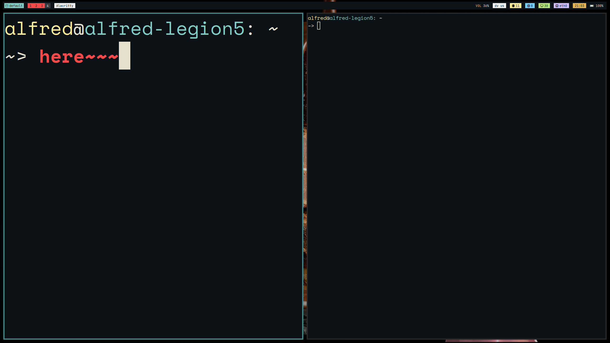

[[toc]]


* [i3wm.org](https://i3wm.org/)

<span style="color: red;font-size: 24px;">我使用的鍵盤layout是dvorak，config檔也是依此設定</span>

我之後會再配合qwerty寫config，現在的說明文件會依照qwerty寫

主要會說明動作+config檔的文法

# i3 介紹

* i3wm 是一個平鋪式的window manager，但是她也支持一般常見的懸浮視窗

    
    > 懸浮視窗，視窗大小、位置可自由調整

    
    > 平鋪視窗，視窗會將畫面填滿

* 另外，i3 還可以以鍵盤對視窗進行操作
    * 這時，你可能會好奇，爲什麼不要用滑鼠就好？還要記一堆麻煩的東西... 以下是我的經驗
        1. 在打code的時候切換視窗需要將手移開、握住滑鼠、找到視窗將游標移上去。這樣一來，下次要打字的時候又要將手定位到正確的位置。
        2. 每次要執行一個動作的時候，需要依靠視覺定位需要的功能，但是鍵盤shortcut只需要靠感覺
    * 不過i3也可以定義滑鼠動作，有時候也能有所奇效

* 第一次打開i3時，會出現以下視窗(在角落，注意一下)：
    

    * 跟著提示按鍵作即可，建議 generate the config以及使用 \<Win\> (鍵盤上的windows logo鍵)
        * 使用 \<Alt\> 鍵的話可能會和應用程式衝突，而且 \<Win\>鍵在linux上是沒用途的

# 基本動作

* 這裏有cheat sheet:
    * mod 鍵被按下
    
    * Shift + mod 鍵同時被按下
    


    * 這個是i3使用預設的config檔時的動作，我會用括號表示我的config的設定值，基本config沒有提到的動作我會放後面。

* 個人認爲預設的config已經很好用了，我的動作也是以這個設定爲基礎建立的

## 0.關閉視窗

* 使用 \<Mod\> + Shift + q(c) 關閉目前視窗
    ```bash
    bindsym $mod+Shift+c kill
    ```

## 1.視窗定位

* 一般而言，i3的視窗會有三種狀態：
    1. focused：目前使用的視窗
    2. inactive：放在旁邊的視窗
    3. urgent：有訊息跑出來的視窗

#### 切換使用的視窗

* &uarr; l(l) 、&darr; k(k)、&larr; ;(;)、&rarr; j(j)

* 將焦點放在目前任一方向的另一視窗
    * 原本的焦點(藍色)
    * \<Win\> + ;
    * 後來的焦點(藍色)

* 在config檔當中的文法：

    ```bash
    # Set Modifier Key
    set mod Mod4
    ...
    bindsym $mod+j focus left
    bindsym $mod+k focus down
    bindsym $mod+l focus up
    bindsym $mod+semicolon focus right 
    ```
    1. config檔的文法與bash相當類似，用```$var```帶入變數
    2. 宣告bindsym形態來設定shortcut
* 註：j、k、l、; 可以用 &larr; &darr; &uarr; &rarr; 代替

#### 移動視窗

* 按下移動shortcut的同時也一起按下Shift鍵

* 視窗會被移動到自己的任意方向
    * 原本視窗位置：
    * Shift + \<Win\> + ;
    * 後來視窗位置：

* config文法
    ```bash
    bindsym $mod+Shift+j move left
    bindsym $mod+Shift+k move down
    bindsym $mod+Shift+l move up
    bindsym $mod+Shift+semicolon move right
    ```

* 註：j、k、l、; 可以用 &larr; &darr; &uarr; &rarr; 代替

## 2. 工作區

* linux 桌面有工作區(Workspace)，可以允許視窗放置，類似windows 的 Virtual Desktop 或MacOS的 Space

* i3的工作區採取的是動態建立的方式，空的工作區會自動被刪掉

* 針對工作區最主要有兩個基本動作：
    * focus到不同的工作區 (\<Win\> + 數字列)
    * 將目前視窗移到不同的工作區 (\<Win\> + Shift + 數字列)

* config語法：

    ```bash
    set $ws1 "1"
    set $ws2 "2"
    set $ws3 "3"
    # ...(跳過)
    set $ws9 "9"
    set $ws10 "10"

    # switch to workspace
    bindsym $mod+1 workspace number $ws1
    bindsym $mod+2 workspace number $ws2
    bindsym $mod+3 workspace number $ws3
    # ...(跳過)
    bindsym $mod+0 workspace number $ws10

    # move focused container to workspace
    b indsym $mod+Shift+1 move container to workspace number $ws1
    bindsym $mod+Shift+2 move container to workspace number $ws2
    bindsym $mod+Shift+3 move container to workspace number $ws3
    # ...(跳過)
    bindsym $mod+Shift+0 move container to workspace number $ws10
    ```
    * 註：工作區的名字必須是 ``` "<number>" | "<number>:<string>```
* 利用```next, prev```可以在存在的工作區移動，```back_and_forth```可以回到上一個所在的工作區
    * e.g.
        ```bash
        bindsym $mod+o workspace next | prev | back_and_forth
        ```

## 3. 視窗狀態

* 一般的floating視窗管理器可以藉由titlebar上的按鈕或是shortcut來調整視窗狀態，例如最大化、全螢幕、最小化...等

#### 最大化

* 沒有這個功能，因爲tiling wm 會自動把螢幕填滿

#### 全螢幕

* 使用 \<Mod\> + f，就可以將目前視窗全螢幕化，類似\<F11\>

* config
    ```bash
    bindsym $mod+f fullscreen toggle
    ```

#### 最小化

* i3 **沒有** 這個功能，原因可能是因爲沒辦法清楚定義
    * 例如：有超過兩個視窗被最小化，要怎麼定義取消最小化？要指定哪一個視窗？

* 取代方案：另外定義一個特別的工作區，最小化時將視窗丟過去；如果需要恢復，到那個工作區把視窗移回去即可

* config
    ```bash
    set $hd "0"
    bindsym $mod+Shift+b workspace number $hd
    bindsym $mod+b move container to workspace number $hd
    ```

> To be continued...
