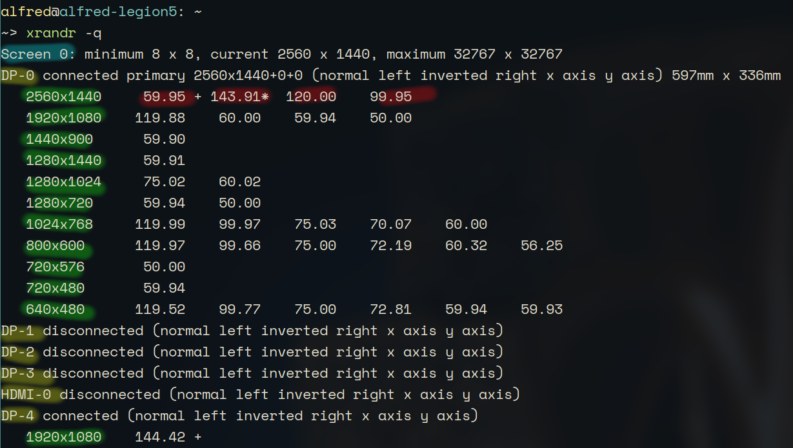

## 0. 查看狀態

* 查看輸出： ```xrandr -q```
    * 輸出如下  
    * 黃色的部分是 **輸出名稱**，是根據輸出孔編碼
    * 藍色的部分是 **display 代碼**，一般來說都是Screen 0
    * 綠色的部分是 **解析率**，"+" 號是預設，"*" 號是當前的設定
    * 紅色的部分是 **更新率**

* 如果需要更詳細的輸出，可以用```xrandr --prop```

## 1. 設定螢幕

* 舉例
    ```bash
    xrandr --output DP-4 --mode 2560x1440 --rate 144 --brightness 0.4 --rotate normal
    ```

* ```--output```
* ```--mode```
* ```--rate```
* ```--brightness```
* ```--rotate```

* ```--auto```

## 2. 多螢幕

* 舉例

## 3. 自訂解析率
